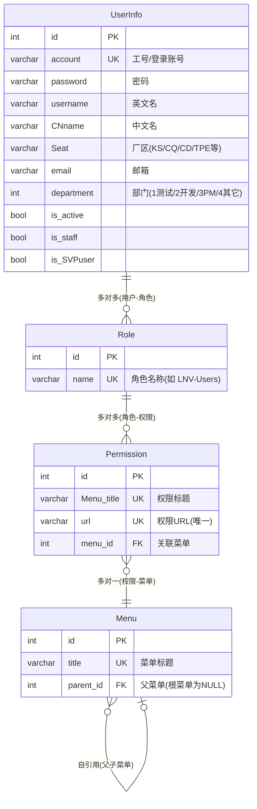
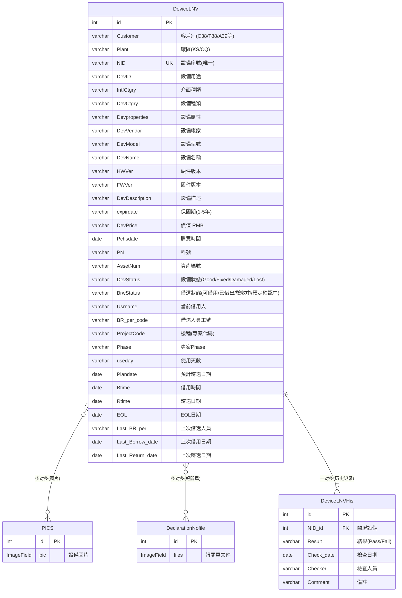

# DMS 设备管理系统 - 技术维护与开发者指引

> **文档版本**：v1.0  
> **创建日期**：2026-08-25  
> **适用对象**：开发人员、系统维护人员、系统拥有者  
> **最后更新**：2026-08-25

---

## 目录

1. [项目概述](#1-项目概述)
2. [技术架构总览](#2-技术架构总览)
3. [项目目录结构](#3-项目目录结构)
4. [主程序位置说明](#4-主程序位置说明)
5. [核心运作逻辑](#5-核心运作逻辑)
6. [后端开发规范](#6-后端开发规范)
7. [前端开发规范](#7-前端开发规范)
8. [数据库设计](#8-数据库设计)
9. [部署与启动指南](#9-部署与启动指南)
10. [日常维护检查清单](#10-日常维护检查清单)
11. [常见问题排查](#11-常见问题排查)
12. [版本与依赖](#12-版本与依赖)

---

## 1. 项目概述

### 1.1 系统简介

**DMS（DQA Device Management System）** 是一套完整的设备管理系统，用于管理 DQA 部门的各类测试设备、电脑、椅柜、机柜、无线 AP、留样等资产的借还、维护、追踪全生命周期管理。

### 1.2 核心业务模块

| 模块名称 | 目录名 | 业务说明 |
|---------|--------|---------|
| 核心应用 | app01 | 登录、首页、用户权限、菜单、定时任务 |
| LNV 设备 | DeviceLNV | LNV 设备借还管理（含 REST API + JWT） |
| ABO 设备 | DeviceABO | ABO 设备借还管理 |
| A39 设备 | DeviceA39 | A39 设备借还管理 |
| CQT88 设备 | DeviceCQT88 | CQT88 设备借还管理 |
| A31 系列设备 | DeviceA31CD/KS/LKE/PCP/TPE | 各厂区 A31 设备管理 |
| A32 系列设备 | DeviceA32KS/TPE | 各厂区 A32 设备管理 |
| APDQA TPE | DeviceAPDQATPE | APDQA TPE 设备管理（含 JWT） |
| 测试 LNV | TestDeviceLNV | LNV 测试设备管理 |
| 适配器电源 | AdapterPowerCode | 适配器电源管理 |
| 电脑管理 | ComputerMS | 电脑资产管理 |
| 椅柜管理 | ChairCabinetMS | 椅柜资产管理 |
| 机柜管理 | CabinetManage | 机柜资产管理 |
| 留样管理 | RetainedSample | 样品留样管理 |
| 无线 AP | WirelessAP | 无线网络 AP 管理 |
| TUM 历史 | TUMHistory | TUM 资产历史同步记录 |

---

## 2. 技术架构总览

### 2.1 架构图

```
┌─────────────────────────────────────────────────────────────┐
│                         客户端浏览器                          │
│   ┌──────────────┐   ┌──────────────┐   ┌───────────────┐   │
│   │  Vue 2.6.10  │   │ Element UI   │   │  jQuery 3.x   │   │
│   │  (浏览器端    │   │  2.12.0      │   │  Bootstrap 3  │   │
│   │   Babel转译)  │   │  (按需引入)   │   │               │   │
│   └──────┬───────┘   └──────┬───────┘   └───────┬───────┘   │
│          └──────────┬───────┴───────────────────┘           │
│                     ▼                                        │
│              Axios / AJAX (HTTP/HTTPS)                       │
└─────────────────────┬───────────────────────────────────────┘
                      │
┌─────────────────────▼───────────────────────────────────────┐
│                   Django 2.1.7 Web Server                     │
│  ┌─────────────────────────────────────────────────────────┐ │
│  │  WSGI / Daphne (WebSocket)                              │ │
│  │  ┌───────────────────────────────────────────────────┐  │ │
│  │  │              Middleware 中间件层                    │  │ │
│  │  │  ┌──────────┐ ┌──────────────┐ ┌────────────────┐ │  │ │
│  │  │  │  Session  │ │ RBAC 权限校验 │ │ 用户IP日志记录 │ │  │ │
│  │  │  └──────────┘ └──────────────┘ └────────────────┘ │  │ │
│  │  └───────────────────────────────────────────────────┘  │ │
│  │  ┌───────────────────────────────────────────────────┐  │ │
│  │  │              URL 路由分发层 (urls.py)              │  │ │
│  │  └───────────────────────────────────────────────────┘  │ │
│  │  ┌───────────────────────────────────────────────────┐  │ │
│  │  │              Views 视图层 (FBV + DRF CBV)          │  │ │
│  │  └───────────────────────────────────────────────────┘  │ │
│  │  ┌───────────────────────────────────────────────────┐  │ │
│  │  │              Models 数据模型层                      │  │ │
│  │  └───────────────────────────────────────────────────┘  │ │
│  └─────────────────────────────────────────────────────────┘ │
│           │                │                  │              │
└───────────┼────────────────┼──────────────────┼──────────────┘
            ▼                ▼                  ▼
   ┌──────────────┐  ┌──────────────┐  ┌──────────────┐
   │   MySQL      │  │  MongoDB     │  │    Redis     │
   │  127.0.0.1   │  │  127.0.0.1   │  │  127.0.0.1   │
   │   :3306      │  │  :27016      │  │   :6379      │
   │  主数据库     │  │  辅助数据库    │  │  消息队列+缓存 │
   └──────────────┘  └──────────────┘  └──────┬───────┘
                                              │
                                ┌─────────────▼──────────────┐
                                │  Celery 4.4.2 异步任务集群  │
                                │  ┌──────────┐ ┌──────────┐ │
                                │  │  Worker  │ │  Beat    │ │
                                │  │(消费者)   │ │(定时器)  │ │
                                │  └──────────┘ └──────────┘ │
                                └────────────────────────────┘
```

### 2.2 技术栈版本速查

| 层级 | 技术组件 | 版本 | 用途 |
|-----|---------|------|------|
| **后端语言** | Python | 3.7.2 | 主编程语言（venv/） |
| **Web 框架** | Django | 2.1.7 | MVC 框架 |
| **REST 框架** | Django REST Framework | 3.11.0 | REST API 开发 |
| **JWT 认证** | djangorestframework-simplejwt | 5.2.0 | API Token 认证 |
| **旧版 JWT** | djangorestframework-jwt | 1.11.0 | 部分模块仍使用 |
| **异步任务** | Celery | 4.4.2 | 异步/定时任务 |
| **Celery DB** | django-celery | 3.3.1 | 数据库调度（部分） |
| **WebSocket** | Channels | 2.2.0 + Daphne 2.5.0 | WebSocket 通信 |
| **Admin UI** | django-simpleui | 2022.4.9 | 后台管理界面 |
| **Excel 导入导出** | django-import-export | 1.2.0 | 数据导入导出 |
| **跨域** | django-cors-headers | 3.7.0 | CORS 支持 |
| **查询过滤** | django-filter | 2.2.0 | 查询参数过滤 |
| **表单渲染** | django-crispy-forms | 1.7.2 | 表单美化 |
| **前端框架** | Vue.js | 2.6.10 | 静态文件 /static/js/vue.min.js |
| **UI 组件库** | Element UI | 2.12.0 | /static/js/Element/*.js（按需引入） |
| **前端路由** | vue-router | 3.1.3 | 部分页面使用 |
| **HTTP 库** | axios | - | AJAX 请求 |
| **DOM 操作** | jQuery | - | /static/js/lib/jquery.min.js |
| **样式框架** | Bootstrap | 3.x | 基础布局样式 |
| **图表** | ECharts | - | 数据可视化 |
| **Excel 解析** | SheetJS (xlsx) | - | 前端 Excel 导入导出 |
| **ES6 转译** | Babel | - | 浏览器端 /static/js/es6/babel.min.js |
| **主数据库** | MySQL | - | 127.0.0.1:3306 / 库名 dms |
| **ORM 驱动** | PyMySQL | 0.9.3 | MySQL Python 驱动 |
| **辅助数据库** | MongoDB | - | 127.0.0.1:27016（mongoengine 0.20.0） |
| **消息队列/缓存** | Redis | - | 127.0.0.1:6379（Broker DB3, Result DB4） |

---

## 3. 项目目录结构

```
DMS/
├── DMS/                          # 项目主配置包
│   ├── __init__.py
│   ├── settings.py               # ★ 开发环境配置（默认）
│   ├── settings_server_.py       # ★ 生产环境配置
│   ├── celery.py                 # ★ Celery 实例定义
│   ├── urls.py                   # ★ 根路由配置
│   └── wsgi.py                   # WSGI 入口
│
├── app01/                        # ★ 核心应用（登录/用户/任务/首页）
│   ├── style_script/             # RBAC 权限前端样式脚本
│   ├── models.py                 # ★ 用户/角色/权限/菜单 模型
│   ├── views.py                  # ★ 登录/登出/注册/首页/汇总 视图
│   ├── tasks.py                  # ★ Celery 定时任务（TUM同步等）
│   ├── tasks_excel.py            # Excel 处理任务
│   ├── forms.py                  # 表单定义
│   ├── admin.py                  # Admin 注册
│   └── apps.py
│
├── DeviceLNV/                    # LNV 设备管理（★ 典型App参考）
│   ├── models.py                 # 设备模型
│   ├── views.py                  # 业务视图
│   ├── urls.py                   # 子路由（含 app_name）
│   ├── serializers.py            # DRF 序列化器
│   ├── authentication.py         # JWT 自定义认证
│   ├── permissions.py            # 自定义权限
│   ├── JWTauth.py                # JWT 认证逻辑
│   ├── admin.py
│   └── apps.py
│
├── DeviceABO/                    # ABO 设备管理
├── DeviceA39/                    # A39 设备管理
├── DeviceCQT88/                  # CQT88 设备管理
├── DeviceA31CD/                  # A31 CD厂区设备
├── DeviceA31KS/                  # A31 KS厂区设备
├── DeviceA31LKE/                 # A31 LKE厂区设备
├── DeviceA31PCP/                 # A31 PCP厂区设备
├── DeviceA31TPE/                 # A31 TPE厂区设备
├── DeviceA32KS/                  # A32 KS厂区设备
├── DeviceA32TPE/                 # A32 TPE厂区设备
├── DeviceAPDQATPE/               # APDQA TPE设备（含JWT）
├── TestDeviceLNV/                # LNV测试设备
├── AdapterPowerCode/             # 适配器电源管理
├── ComputerMS/                   # 电脑资产管理
├── ChairCabinetMS/               # 椅柜资产管理
├── CabinetManage/                # 机柜管理
├── RetainedSample/               # 留样管理
├── WirelessAP/                   # 无线AP管理
├── TUMHistory/                   # TUM历史同步
│
├── middleware/                    # ★ 自定义中间件
│   ├── checkper.py               # ★ RBAC 权限校验中间件
│   └── UserIP.py                 # ★ 用户访问IP日志中间件
│
├── service/
│   └── init_permission.py        # ★ 权限初始化（登录时写入 Session）
│
├── extra_apps/
│   └── xadmin/                   # 自定义 xadmin 后台
│
├── templates/                     # ★ Django 模板目录
│   ├── base.html                 # ★ 基础模板（所有页面继承）
│   ├── login.html                # 登录页
│   ├── index.html                # 首页/Dashboard
│   ├── NoPerm.html               # 无权限提示页
│   ├── ChangeSkin.html           # 皮肤切换页
│   ├── Summary.html              # 汇总页
│   ├── Summary_ABO.html          # ABO汇总页
│   ├── Signin*.html              # 各模块注册页（共10+个）
│   └── <app_name>/               # 各应用专属模板目录
│
├── static/                        # ★ 前端静态资源
│   ├── js/
│   │   ├── vue.min.js            # Vue 2.6.10
│   │   ├── axios.min.js          # HTTP 库
│   │   ├── qs.js                 # 参数序列化
│   │   ├── vue-router.min.js     # 路由
│   │   ├── es6/
│   │   │   ├── babel.min.js      # 浏览器端Babel转译
│   │   │   └── polyfill.min.js   # ES6 Polyfill
│   │   ├── Element/              # ★ Element UI 按需组件
│   │   │   ├── index.js
│   │   │   ├── main.js
│   │   │   ├── table.js
│   │   │   ├── form.js
│   │   │   ├── dialog.js
│   │   │   ├── input.js
│   │   │   ├── image.js
│   │   │   └── icon.js
│   │   ├── lib/
│   │   │   ├── jquery.min.js     # jQuery
│   │   │   └── bootstrap.min.js  # Bootstrap
│   │   ├── echart/echart.js      # ECharts 图表
│   │   └── xlsx/xlsx.js          # SheetJS Excel处理
│   ├── css/
│   │   ├── ElementUI.css
│   │   ├── bootstrap.min.css
│   │   ├── style.css             # 全局样式
│   │   └── lib/                  # 第三方样式库
│   ├── images/                   # 图片资源
│   ├── fonts/                    # 字体图标
│   └── src/                      # 背景图、静态资源
│
├── logs/                          # ★ 日志目录（按日期分文件）
│   ├── all-YYYY-MM-DD.log        # 全部日志
│   ├── info-YYYY-MM-DD.log       # INFO 级别
│   └── error-YYYY-MM-DD.log      # ERROR 级别
│
├── medias/                        # 上传文件（项目内置，非主MEDIA_ROOT）
├── venv/                          # Python 虚拟环境
│
├── DMSceleryworker.bat            # ★ Celery Worker 启动脚本
├── DMSceleryworker-see.bat        # Celery Worker 前台启动（可看日志）
├── DMScelerybeat.bat              # ★ Celery Beat 定时调度启动脚本
├── DMScelerybeat-see.bat          # Celery Beat 前台启动
├── manage.py                      # Django 管理脚本
├── requirements.txt               # ★ Python 依赖清单
│
├── SMTPMail.py                    # 邮件发送工具
├── SMTPMailyibu.py                # 异步邮件发送
├── test_smtp.py                   # SMTP 测试脚本
│
├── DMSscheduleflag.txt            # 定时任务标志文件
├── DMSscheduleflags.txt
├── TUMInputflag.txt
├── celerybeat-schedule.*          # Celery Beat 调度状态持久化
└── celerybeat.pid                 # Celery Beat PID 文件
```

---

## 4. 主程序位置说明

### 4.1 后端核心文件速查表

| 功能 | 文件路径 | 关键内容 |
|-----|---------|---------|
| **Django 入口** | [manage.py](file:///c:/djangoproject/DMS/manage.py) | `DJANGO_SETTINGS_MODULE = DMS.settings` |
| **开发配置** | [DMS/settings.py](file:///c:/djangoproject/DMS/DMS/settings.py) | 数据库、Redis、Celery、权限白名单、日志 |
| **生产配置** | [DMS/settings_server_.py](file:///c:/djangoproject/DMS/DMS/settings_server_.py) | 生产环境专用配置（切换方法见第9节） |
| **根路由** | [DMS/urls.py](file:///c:/djangoproject/DMS/DMS/urls.py) | 所有 App 的 URL 挂载点 |
| **Celery 实例** | [DMS/celery.py](file:///c:/djangoproject/DMS/DMS/celery.py) | Celery App 定义、自动发现 tasks |
| **WSGI 入口** | [DMS/wsgi.py](file:///c:/djangoproject/DMS/DMS/wsgi.py) | 部署用 WSGI 应用 |
| **用户权限模型** | [app01/models.py](file:///c:/djangoproject/DMS/app01/models.py) | UserInfo / Role / Permission / Menu |
| **登录核心逻辑** | [app01/views.py](file:///c:/djangoproject/DMS/app01/views.py#L91-L162) | login()、signin*()、权限初始化 |
| **首页/汇总** | [app01/views.py](file:///c:/djangoproject/DMS/app01/views.py) | index()、Summary()、DevicesSummary() |
| **RBAC 中间件** | [middleware/checkper.py](file:///c:/djangoproject/DMS/middleware/checkper.py) | URL 级权限校验（白名单、正则匹配） |
| **IP 日志中间件** | [middleware/UserIP.py](file:///c:/djangoproject/DMS/middleware/UserIP.py) | 访问 IP 记录 |
| **权限初始化** | [service/init_permission.py](file:///c:/djangoproject/DMS/service/init_permission.py) | 登录时将权限 URL/菜单写入 Session |
| **定时任务** | [app01/tasks.py](file:///c:/djangoproject/DMS/app01/tasks.py) | GetTumdata、Ongoing_flag、warmup_cache 等 |
| **典型设备App路由** | [DeviceLNV/urls.py](file:///c:/djangoproject/DMS/DeviceLNV/urls.py) | 含 JWT API 的标准 App 路由 |
| **典型设备App模型** | [DeviceLNV/models.py](file:///c:/djangoproject/DMS/DeviceLNV/models.py) | 设备主模型 + 历史记录模型 |

### 4.2 前端核心文件速查表

| 功能 | 文件路径 | 关键内容 |
|-----|---------|---------|
| **基础模板** | [templates/base.html](file:///c:/djangoproject/DMS/templates/base.html) | 所有页面继承此模板，含侧边栏、顶栏、块定义 |
| **登录页模板** | [templates/login.html](file:///c:/djangoproject/DMS/templates/login.html) | 登录表单 |
| **首页模板** | [templates/index.html](file:///c:/djangoproject/DMS/templates/index.html) | Dashboard 主页面 |
| **Vue 库** | [static/js/vue.min.js](file:///c:/djangoproject/DMS/static/js/vue.min.js) | Vue 2.6.10 运行时 |
| **Babel 转译** | [static/js/es6/babel.min.js](file:///c:/djangoproject/DMS/static/js/es6/babel.min.js) | 浏览器端 ES6 → ES5 转译 |
| **Axios** | [static/js/axios.min.js](file:///c:/djangoproject/DMS/static/js/axios.min.js) | HTTP 请求库 |
| **Element UI 组件** | [static/js/Element/](file:///c:/djangoproject/DMS/static/js/Element/) | table.js、form.js、dialog.js 等按需引入 |
| **Element UI 样式** | [static/css/ElementUI.css](file:///c:/djangoproject/DMS/static/css/ElementUI.css) | 组件样式 |
| **jQuery** | [static/js/lib/jquery.min.js](file:///c:/djangoproject/DMS/static/js/lib/jquery.min.js) | DOM 操作 |
| **Bootstrap** | [static/css/bootstrap.min.css](file:///c:/djangoproject/DMS/static/css/bootstrap.min.css) | 基础布局 |

---

## 5. 核心运作逻辑

### 5.1 用户认证与权限流程

```
用户访问 URL
    │
    ▼
┌─────────────────────────┐
│  RbacMiddleware 中间件   │  middleware/checkper.py
│  (按顺序执行)           │
└───────────┬─────────────┘
            │
    ┌───────▼────────┐
    │ 是否在白名单？   │───是──▶ 直接放行
    │  (SAFE_URL)     │
    └───────┬────────┘
            │否
    ┌───────▼────────────┐
    │ Session 有 permission │
    │ _url 吗？           │───否──▶ 重定向 /login/
    └───────┬────────────┘
            │是
    ┌───────▼────────────────────────────┐
    │ 遍历 permission_url 正则匹配当前 URL │
    └───────┬────────────────────────────┘
            │匹配成功          │匹配失败
            ▼                  ▼
       正常放行           渲染 NoPerm.html
       (设置 Cookie         (无权限提示页)
        current_page_DMS)
```

**关键配置项**（settings.py）：
```python
LOGIN_URL = '/login/'
SESSION_PERMISSION_URL_KEY = 'URL_per'     # Session 中存储权限URL的Key
SESSION_MENU_KEY = 'awesome'                # Session 中存储菜单的Key
SAFE_URL = [r'/login/', r'/admin/.*', ...]  # 权限白名单（正则）
```

### 5.2 登录流程详解

```
用户提交账号密码 (POST /login/)
    │
    ▼
[app01/views.py: login()]
    │
    ├─ 1. 查询 UserInfo 表验证账号密码
    │
    ├─ 2. 写入 Session：
    │     - is_login_DMS = True
    │     - user_id_DMS / user_name_DMS / CNname_DMS
    │     - account_DMS
    │     - 过期时间：12小时
    │
    ├─ 3. 调用 init_permission(request, user_obj)
    │     │  [service/init_permission.py]
    │     └─ 查询 用户→角色→权限 关联，获取：
    │        - 权限 URL 列表 → Session[URL_per]
    │        - 菜单层级结构 → Session[awesome]
    │
    └─ 4. 重定向到来源页或 /index/
```

### 5.3 定时任务（Celery Beat + Worker）

**调度配置**（settings.py CELERY_BEAT_SCHEDULE）：

| 任务名 | 函数 | 执行频率 | 说明 |
|-------|------|---------|------|
| task-two | app01.tasks.GetTumdata | 每天 02:00 | 从 FTP 下载 TUM Excel 并同步入库 |
| task-flag | app01.tasks.Ongoing_flag | 每 60 秒 | 设备借用超时标志检查 |
| task-flags | app01.tasks.Ongoing_flags | 每 180 秒 | 设备借用超时标志检查（扩展） |
| warmup-cache | app01.tasks.warmup_cache | 每天 03:00 | 缓存预热 |

**Redis 库分配**：
- DB 3：Celery Broker（消息队列）
- DB 4：Celery Result Backend（任务结果）

### 5.4 设备借还核心流程（以 DeviceLNV 为例）

```
用户进入设备列表页 (M_Category)
    │
    ├─ 申请借用 (R_Destine)
    │     └─ 更新 BrwStatus = '預定確認中'
    │
    ├─ 借出确认 (R_Borrowed → M_Borrow)
    │     ├─ 更新 BrwStatus = '已借出'
    │     ├─ 写入 Usrname / BR_per_code / ProjectCode
    │     ├─ 写入 Btime (借用时间) / Plandate (预计归还)
    │     └─ 递增 UsrTimes (借还次数)
    │
    ├─ 续借 (R_Keep → M_Keep)
    │     └─ BrwStatus = '續借確認中' → 更新 Plandate
    │
    └─ 归还 (R_Return → M_Return)
          ├─ BrwStatus = '歸還確認中' → '可借用'
          ├─ 写入 Rtime (归还日期)
          ├─ 归档 Last_* 字段（上次借还记录）
          └─ 清空当前借用者信息
```

### 5.5 JWT API 认证（DeviceLNV / DeviceAPDQATPE）

```
客户端 POST /DeviceLNV/api/login/
  Body: {"username": "...", "password": "..."}
    │
    ▼
[MyTokenObtainPairView]  返回:
{
  "access": "<30分钟有效Token>",
  "refresh": "<20分钟有效RefreshToken>"
}
    │
    ▼
后续请求 Header:
  Authorization: Bearer <access_token>
    │
    ▼
访问受保护 DRF View（DeviceLNV_api/）
```

---

## 6. 后端开发规范

### 6.1 新建一个设备管理 App 的标准步骤

**Step 1：创建 App 骨架**
```bash
# 进入虚拟环境后
cd c:\djangoproject\DMS
venv\Scripts\activate
python manage.py startapp DeviceXXX
```

**Step 2：标准 App 文件结构**（参考 DeviceLNV）
```
DeviceXXX/
├── __init__.py
├── admin.py        # 注册模型到 SimpleUI 后台
├── apps.py         # AppConfig（verbose_name 繁体中文）
├── models.py       # 数据模型（verbose_name 繁体中文）
├── urls.py         # 必须定义 app_name = 'DeviceXXX'
├── views.py        # 函数视图 (FBV) + @csrf_exempt
└── tests.py
```

**Step 3：在 settings.py INSTALLED_APPS 注册**
```python
INSTALLED_APPS = [
    ...
    'DeviceXXX',   # 添加
]
```

**Step 4：在 DMS/urls.py 挂载子路由**
```python
path('DeviceXXX/', include('DeviceXXX.urls', namespace='DeviceXXX')),
```

### 6.2 模型编写规范（必须遵守）

```python
from django.db import models

class DeviceXXX(models.Model):
    """
    模型类注释：说明模型用途
    """
    # 选项元组使用繁体中文
    Status_choice = (
        ('可借用', '可借用'),
        ('已借出', '已借出'),
        ('驗收中', '驗收中'),
    )
    
    # 字段 verbose_name 必须使用繁体中文
    NID = models.CharField(max_length=16, unique=True, verbose_name='設備序號')
    DevName = models.CharField(max_length=256, verbose_name='設備名稱')
    Status = models.CharField(max_length=32, choices=Status_choice, verbose_name='借還狀態')
    Pchsdate = models.DateField(null=True, blank=True, verbose_name='購買日期')
    Photo = models.ManyToManyField(PICS, related_name='xxx_pics', blank=True, verbose_name='圖片表')
    
    class Meta:
        verbose_name = 'Device_XXX'        # 单数
        verbose_name_plural = verbose_name # 复数不加s
    
    def __str__(self):
        return '{NID}>>{DevName}'.format(NID=self.NID, DevName=self.DevName)
```

**关键规范**：
- `verbose_name` 全部**繁体中文**
- choices 元组标签**繁体中文**
- 必须定义 `__str__` 方法
- 图片/文件字段配套 `pre_delete` signal 清理物理文件
- 保持与现有模型字段风格一致（如 `BrwStatus`、`Usrname`、`Last_BR_per` 等命名）

### 6.3 视图编写规范（FBV 优先）

```python
from django.shortcuts import render, redirect, HttpResponse
from django.views.decorators.csrf import csrf_exempt
from django.http import JsonResponse
from django.db import transaction
from django.db.models import Q
import logging

logger = logging.getLogger('log')

@csrf_exempt  # 项目惯例：AJAX 接口加此装饰器
def M_Category(request):
    """设备类别管理页面 - 列表查询"""
    # 1. 权限检查（RBAC 中间件已做 URL 级别检查）
    # 2. 业务逻辑
    search_key = request.GET.get('search', '')
    queryset = DeviceXXX.objects.all()
    if search_key:
        queryset = queryset.filter(
            Q(NID__icontains=search_key) | Q(DevName__icontains=search_key)
        )
    # 3. 异常处理
    try:
        data_list = list(queryset.values())
    except Exception as e:
        logger.error(f'DeviceXXX查询失败: {e}')
        return JsonResponse({'status': -1, 'msg': str(e)})
    # 4. 响应
    if request.is_ajax() or request.META.get('HTTP_X_REQUESTED_WITH') == 'XMLHttpRequest':
        return JsonResponse({'status': 0, 'data': data_list})
    weizhi = 'DeviceXXX / 设备列表'
    return render(request, 'DeviceXXX/M_Category.html', locals())

@csrf_exempt
@transaction.atomic  # 写操作加事务
def M_edit(request):
    """新增/编辑设备"""
    if request.method == 'POST':
        try:
            nid = request.POST.get('NID')
            obj, created = DeviceXXX.objects.update_or_create(
                NID=nid,
                defaults={
                    'DevName': request.POST.get('DevName'),
                    'Status': request.POST.get('Status', '可借用'),
                }
            )
            return JsonResponse({'status': 0, 'msg': '操作成功'})
        except Exception as e:
            logger.error(f'DeviceXXX编辑失败: {e}')
            transaction.rollback()
            return JsonResponse({'status': -1, 'msg': str(e)})
```

### 6.4 子路由 urls.py 规范

```python
from django.urls import path
from . import views

app_name = 'DeviceXXX'  # ★ 必须定义，与 namespace 对应

urlpatterns = [
    path('M_Category/', views.M_Category, name='M_Category'),
    path('M_edit/', views.M_edit, name='M_edit'),
    path('R_Borrow/', views.R_Borrow, name='R_Borrow'),
    path('R_Return/', views.R_Return, name='R_Return'),
]
```

### 6.5 数据库迁移流程

```bash
# 1. 生成迁移文件
python manage.py makemigrations DeviceXXX

# 2. 查看 SQL（可选，用于审查）
python manage.py sqlmigrate DeviceXXX 0001

# 3. 执行迁移
python manage.py migrate DeviceXXX
```

> ⚠️ **重要**：迁移前务必备份数据库！生产环境先在测试机验证通过再执行。

---

## 7. 前端开发规范

### 7.1 页面模板标准结构（★ 必须遵守）

```html



XXX 设备管理


<!-- 页面专属 CSS，不影响其他页面 -->
<style>
.custom-box { padding: 10px; }
</style>



<div id="app">
    <!-- Vue 模板必须使用 ${ } 插值，不可用 {{ }} -->
    <div class="container-fluid">
        <div class="row">
            <div class="col-lg-12">
                <!-- Element UI 组件 -->
                <el-input v-model="searchKey" placeholder="搜索设备序号" @keyup.enter.native="searchData"></el-input>
                <el-button type="primary" @click="searchData">查询</el-button>
                
                <el-table :data="tableData" border stripe style="width: 100%">
                    <el-table-column prop="NID" label="設備序號" width="150"></el-table-column>
                    <el-table-column prop="DevName" label="設備名稱"></el-table-column>
                    <el-table-column prop="BrwStatus" label="借還狀態" width="120">
                        <template slot-scope="scope">
                            <el-tag :type="getStatusType(scope.row.BrwStatus)">${ scope.row.BrwStatus }</el-tag>
                        </template>
                    </el-table-column>
                    <el-table-column label="操作" width="200" fixed="right">
                        <template slot-scope="scope">
                            <el-button size="mini" type="primary" @click="editRow(scope.row)">编辑</el-button>
                            <el-button size="mini" type="danger" @click="deleteRow(scope.row)">删除</el-button>
                        </template>
                    </el-table-column>
                </el-table>
                
                <el-pagination
                    @size-change="handleSizeChange"
                    @current-change="handleCurrentChange"
                    :current-page="currentPage"
                    :page-sizes="[10, 20, 50, 100]"
                    :page-size="pageSize"
                    layout="total, sizes, prev, pager, next, jumper"
                    :total="total">
                </el-pagination>
            </div>
        </div>
    </div>
</div>



<!-- 顺序：polyfill → babel → axios → vue → qs → Element index → 按需组件 -->
<script src="/static/js/es6/polyfill.min.js"></script>
<script src="/static/js/es6/babel.min.js"></script>
<script src="/static/js/axios.min.js"></script>
<script src="/static/js/vue.min.js"></script>
<script src="/static/js/qs.js"></script>
<script src="/static/js/Element/index.js"></script>
<script src="/static/js/Element/main.js"></script>
<!-- 按需引入 Element 组件（用到哪些引哪些） -->
<script src="/static/js/Element/table.js"></script>
<script src="/static/js/Element/form.js"></script>
<script src="/static/js/Element/input.js"></script>
<script src="/static/js/Element/button.js"></script>
<script src="/static/js/Element/dialog.js"></script>
<script src="/static/js/Element/tag.js"></script>
<script src="/static/js/Element/pagination.js"></script>
<script src="/static/js/Element/message.js"></script>
<script src="/static/js/Element/message-box.js"></script>

<script type="text/babel">
new Vue({
    el: '#app',
    delimiters: ['${', '}'],  // ★ 关键：避免与 Django {{ }} 冲突
    data: function () {
        return {
            searchKey: '',
            tableData: [],
            currentPage: 1,
            pageSize: 10,
            total: 0,
        };
    },
    created: function () {
        // 页面加载时请求数据
        this.loadData();
    },
    methods: {
        loadData: function () {
            var params = {
                page: this.currentPage,
                size: this.pageSize,
                search: this.searchKey,
            };
            axios.get('/DeviceXXX/M_Category/', {
                params: params,
                headers: {'X-Requested-With': 'XMLHttpRequest'}
            }).then(response => {
                if (response.data.status === 0) {
                    this.tableData = response.data.data;
                    this.total = response.data.total || 0;
                } else {
                    this.$message.error(response.data.msg || '加载失败');
                }
            }).catch(error => {
                console.error(error);
                this.$message.error('网络异常');
            });
        },
        searchData: function () {
            this.currentPage = 1;
            this.loadData();
        },
        getStatusType: function (status) {
            var map = {
                '可借用': 'success',
                '已借出': 'warning',
                '驗收中': 'info',
            };
            return map[status] || '';
        },
        editRow: function (row) {
            // TODO: 打开编辑弹窗
        },
        deleteRow: function (row) {
            this.$confirm('确认删除此设备?', '提示', {
                confirmButtonText: '确定',
                cancelButtonText: '取消',
                type: 'warning'
            }).then(() => {
                // TODO: 调用删除接口
            }).catch(() => {});
        },
        handleSizeChange: function (val) {
            this.pageSize = val;
            this.loadData();
        },
        handleCurrentChange: function (val) {
            this.currentPage = val;
            this.loadData();
        },
    }
});
</script>

```

### 7.2 前端约束红线（严禁违反）

| 编号 | 约束内容 | 原因 |
|-----|---------|------|
| 1 | Vue 插值必须用 `${ }`，严禁 `{{ }}` | 与 Django 模板语法冲突，会导致渲染异常 |
| 2 | `<script>` 必须用 `type="text/babel"` | 项目使用浏览器端 Babel 转译 ES6，不加会直接报语法错误 |
| 3 | 严禁引入 webpack/vite/rollup 等构建工具 | 项目是 Django 模板架构，无构建工具链 |
| 4 | 严禁修改 templates/base.html 全局样式 | 会影响所有子页面 |
| 5 | Element UI 组件按需引入，不要整包 | 已有按需组件位于 static/js/Element/*.js |
| 6 | 静态资源路径一律用绝对路径 `/static/...` | 避免相对路径在不同 URL 下解析错误 |
| 7 | 严禁使用 React / Angular | 项目技术栈锁定 Vue 2 |
| 8 | 样式写在 `` 内 | 隔离，不影响其他子页面 |

### 7.3 AJAX 请求标准范式

```javascript
// GET 请求（带参数）
axios.get('/DeviceXXX/api/list/', {
    params: { key: value, page: 1 },
    headers: { 'X-Requested-With': 'XMLHttpRequest' }
}).then(res => {
    // 统一响应格式约定：{ status: 0/-1, data: ..., msg: '...' }
    if (res.data.status === 0) {
        // 成功处理
    } else {
        this.$message.error(res.data.msg || '操作失败');
    }
}).catch(err => {
    console.error(err);
    this.$message.error('网络异常，请稍后重试');
});

// POST 请求（表单数据）
axios.post('/DeviceXXX/M_edit/', 
    qs.stringify({ NID: 'A001', DevName: '测试设备' }),  // qs序列化
    { headers: { 'Content-Type': 'application/x-www-form-urlencoded' } }
).then(res => { ... });

// POST 请求（JSON 数据 + JWT Token）
axios.post('/DeviceLNV/api/action/',
    { action: 'borrow', nid: 'A001' },
    { headers: { 
        'Content-Type': 'application/json',
        'Authorization': 'Bearer ' + localStorage.getItem('access_token')
    }}
).then(res => { ... });
```

---

## 8. 数据库设计

### 8.1 权限系统核心四表（app01）



### 8.2 设备管理核心表（以 DeviceLNV 为例）



### 8.3 数据库连接信息

| 数据库 | 地址 | 端口 | 账号 | 库名 | 用途 |
|-------|------|------|------|------|------|
| MySQL | 127.0.0.1 | 3306 | edwin | dms | **主数据库**（所有 Django Model） |
| MongoDB | 127.0.0.1 | 27016 | edwin | admin | 辅助数据库（通过 mongoengine 连接） |
| Redis | 127.0.0.1 | 6379 | (密码:DCT2019) | DB3/DB4 | Celery Broker/Result 队列 |

---

## 9. 部署与启动指南

### 9.1 环境要求

- **操作系统**：Windows Server / Windows 10/11
- **Python**：3.7.2（必须，虚拟环境已内置 `venv/`）
- **MySQL**：5.7+ 或 8.0（需开启 3306 端口）
- **MongoDB**：4.0+（27016 端口）
- **Redis**：5.0+（6379 端口，密码 DCT2019）

### 9.2 快速启动（开发环境）

**Step 1：激活虚拟环境**
```cmd
cd c:\djangoproject\DMS
venv\Scripts\activate
```

**Step 2：验证数据库连接**  
确认 MySQL、MongoDB、Redis 三个服务都已启动且可连接。

**Step 3：启动 Django Web 服务**
```cmd
python manage.py runserver 0.0.0.0:8000
# 浏览器访问 http://127.0.0.1:8000/
```

**Step 4：启动 Celery Worker（异步任务消费者）**
```cmd
# 方式 A：后台模式（使用封装脚本）
DMSceleryworker.bat

# 方式 B：前台模式（调试用，可看到日志输出）
DMSceleryworker-see.bat
```

**Step 5：启动 Celery Beat（定时任务调度器）**
```cmd
# 方式 A：后台模式
DMScelerybeat.bat

# 方式 B：前台模式（调试用）
DMScelerybeat-see.bat
```

> ⚠️ **必须启动的 3 个进程**：Django + Celery Worker + Celery Beat。缺少任何一个都会导致部分功能异常。

### 9.3 切换生产环境配置

修改 [manage.py](file:///c:/djangoproject/DMS/manage.py#L6) 第 6 行：
```python
# 开发环境（默认）
os.environ.setdefault('DJANGO_SETTINGS_MODULE', 'DMS.settings')

# 生产环境（切换为）
os.environ.setdefault('DJANGO_SETTINGS_MODULE', 'DMS.settings_server_')
```

### 9.4 Admin 后台访问

- 地址：`http://127.0.0.1:8000/admin/`
- 登录：使用具有 `is_staff=True` 的 `UserInfo` 账号
- 功能：通过 SimpleUI 管理所有数据表（用户、角色、权限、各设备等）

### 9.5 权限初始化（新系统首次部署）

1. 通过 `/admin/` 后台创建 `Menu`（菜单层级）
2. 创建 `Permission`（关联 Menu + URL）
3. 创建 `Role`（关联多个 Permission）
4. 创建/分配 `UserInfo` 角色
5. 用户重新登录后，权限自动写入 Session

---

## 10. 日常维护检查清单

### 10.1 每日检查（Daily）

| 序号 | 检查项 | 检查方法 | 正常状态 | 异常处理 |
|-----|-------|---------|---------|---------|
| 1 | Django 进程存活 | `netstat -ano | findstr :8000` | 有 LISTENING 进程 | 重启 `python manage.py runserver` |
| 2 | Celery Worker 存活 | 查看 logs/all-*.log 中 celery 日志 | 周期性任务日志正常 | 重启 `DMSceleryworker.bat` |
| 3 | Celery Beat 存活 | 查看 celerybeat.pid 是否存在，进程是否运行 | PID 文件存在，进程存活 | 重启 `DMScelerybeat.bat` |
| 4 | MySQL 连接正常 | `mysql -u edwin -p -e "USE dms; SHOW TABLES;"` | 正常返回表列表 | 检查 MySQL 服务、账号密码 |
| 5 | Redis 连接正常 | `redis-cli -a DCT2019 ping` | 返回 PONG | 检查 Redis 服务、密码 |
| 6 | 磁盘空间 | `dir c:\` 查看可用空间 | 剩余 > 10GB | 清理 logs/、medias/ 下老文件 |
| 7 | 最新错误日志 | 打开 `logs/error-今日.log` | 无新增 ERROR 条目 | 排查错误堆栈并修复 |

### 10.2 每周检查（Weekly）

| 序号 | 检查项 | 检查方法 |
|-----|-------|---------|
| 1 | 日志轮转是否正常 | `logs/` 目录下按日期分文件，单文件不超过 5MB（RotatingFileHandler 设置） |
| 2 | Celery 定时任务执行 | 检查 `task-two`（TUM同步）是否在 02:00 成功执行，查看 logs/all-*.log |
| 3 | 数据库备份 | 确认 MySQL `dms` 库有每日备份（mysqldump） |
| 4 | Session 清理 | 执行 `python manage.py clearsessions` 清理过期 Session |
| 5 | 借还超时提醒 | 查看各设备 `BrwStatus='已借出'` 且 `Plandate < TODAY` 的记录，必要时邮件提醒 |

### 10.3 每月检查（Monthly）

| 序号 | 检查项 | 检查方法 |
|-----|-------|---------|
| 1 | 数据库表空间 | MySQL `SHOW TABLE STATUS FROM dms;` 关注大表数据量 |
| 2 | MongoDB 集合 | `mongo --port 27016 -u edwin -p DCT@2019 admin` 查看集合状态 |
| 3 | Redis 内存 | `redis-cli -a DCT2019 info memory` 关注 used_memory_human |
| 4 | 用户账号审计 | 检查长期未登录（>90天）的账号，必要时禁用 `is_active=False` |
| 5 | 权限审计 | 导出角色-权限映射，核对权限是否合理 |
| 6 | 安全补丁 | 检查 Windows 补丁、Python 依赖安全更新（谨慎升级，避免破坏兼容） |

### 10.4 维护操作速查命令

```cmd
:: 激活虚拟环境（所有命令前提）
cd c:\djangoproject\DMS
venv\Scripts\activate

:: Django 常用
python manage.py check                      # 检查项目完整性
python manage.py makemigrations <AppName>   # 生成迁移脚本
python manage.py migrate <AppName>          # 执行迁移
python manage.py createsuperuser            # 创建超级管理员
python manage.py clearsessions              # 清理过期 Session
python manage.py collectstatic --noinput    # 收集静态文件（生产部署用）

:: 数据库备份/恢复
:: 备份
mysqldump -u edwin -pDCT@2019 dms > backup_dms_%DATE:~0,4%%DATE:~5,2%%DATE:~8,2%.sql
:: 恢复
mysql -u edwin -pDCT@2019 dms < backup_dms_20260825.sql

:: Redis 检查
redis-cli -a DCT2019 info server     # 查看服务信息
redis-cli -a DCT2019 -n 3 llen celery # 查看队列积压（DB3=Broker）
redis-cli -a DCT2019 -n 4 dbsize      # 查看结果数量（DB4=Result）
```

---

## 11. 常见问题排查

### 11.1 登录问题

**Q1：登录后一直停留在登录页，无报错**
- 检查 Session 存储（数据库表 `django_session`）
- 确认浏览器 Cookie 启用，检查 `SESSION_COOKIE_AGE` 配置
- 查看 `logs/all-*.log` 中是否有异常

**Q2：登录后提示「无权限访问」**
- 确认该用户已分配角色（`UserInfo.role`）
- 确认角色已绑定对应 Permission（`Role.perms`）
- 重新登录触发权限初始化（`init_permission`）
- 确认目标 URL 已正确录入 Permission 表

### 11.2 前端页面问题

**Q3：页面空白，F12 报 `SyntaxError: Unexpected token ...`**
- 原因：缺少 `type="text/babel"` 或未加载 `babel.min.js`
- 修复：检查 `<script type="text/babel">` 是否正确，检查 babel.min.js 引入顺序

**Q4：Vue 变量不渲染，页面上显示 `${xxx}` 字面量**
- 原因：未设置 `delimiters: ['${', '}']`
- 修复：在 `new Vue({...})` 中加入 `delimiters: ['${', '}']`

**Q5：Element UI 组件显示为原始标签名（如 `<el-table>` 未渲染）**
- 原因：组件未按需引入
- 修复：在 `` 中引入对应 `/static/js/Element/xxx.js`，且 `Element/index.js` 和 `Element/main.js` 必须先引入

### 11.3 数据库问题

**Q6：`django.db.utils.OperationalError: (1045, "Access denied for user...")`**
- 检查 settings.py 中 MySQL 用户名/密码/端口
- 确认 MySQL 服务已启动，允许 127.0.0.1 连接
- 测试：`mysql -u edwin -pDCT@2019 -h 127.0.0.1 -P 3306 dms`

**Q7：`pymongo/ mongoengine` 连接超时或认证失败**
- 检查 MongoDB 端口 27016 是否监听
- 确认 MongoDB 用户 `edwin` 有 `admin` 库权限
- settings.py 第 237-242 行连接串验证

### 11.4 Celery / 异步任务问题

**Q8：定时任务不执行**
1. 确认两个进程都在运行：Celery Worker + Celery Beat
2. 检查 Redis 连接：`redis-cli -a DCT2019 ping`
3. 检查 Beat 调度：`celerybeat-schedule.dat` 文件是否损坏（删除后重启 Beat 重新生成）
4. 查看 `logs/all-*.log` 中任务执行日志

**Q9：Celery Worker 启动报 `Not enough privileges` 或 eventlet 错误**
- 项目使用 eventlet 作为并发池，确保已安装（见 requirements.txt）
- 启动脚本正确设置了 `-P eventlet` 参数

### 11.5 文件上传/媒体问题

**Q10：图片/文件上传后 404 无法访问**
- 检查 `settings.MEDIA_ROOT = 'c:\\DMSmedia'` 路径存在且有写入权限
- 检查根路由第 54 行 `re_path('^media/(?P<path>.*)$', serve, ...)` 是否正常
- 如果磁盘路径非默认，需同步修改 settings.py 中 MEDIA_ROOT 和 MEDIAFILES_DIRS

---

## 12. 版本与依赖

### 12.1 核心依赖（严禁随意升级主版本）

| 依赖 | 当前版本 | 升级风险等级 | 说明 |
|-----|---------|------------|------|
| Django | 2.1.7 | 🔴 极高 | 升级会破坏所有 App 兼容性 |
| Python | 3.7.2 | 🔴 极高 | 语法变化，大量库不兼容 3.8+ |
| djangorestframework | 3.11.0 | 🟡 中 | 3.12+ 有破坏性变更 |
| Celery | 4.4.2 | 🟡 中 | 5.x API 变化较大 |
| Vue.js | 2.6.10 | 🔴 极高 | Vue 3 语法完全不同 |
| Element UI | 2.12.0 | 🟡 中 | 2.15.x 兼容但需测试 |
| PyMySQL | 0.9.3 | 🟡 中 | 需与 MySQL 8.0 认证方式兼容 |
| mongoengine | 0.20.0 | 🟡 中 | 需与 MongoDB 版本匹配 |
| redis-py | 5.0.1 | 🟠 中高 | 与 Redis 服务端版本相关 |

### 12.2 新依赖安装流程

```cmd
:: 1. 进入虚拟环境
cd c:\djangoproject\DMS
venv\Scripts\activate

:: 2. 安装（固定版本号）
pip install django-simple-captcha==0.5.10

:: 3. 验证
python manage.py check

:: 4. 记录到 requirements.txt
pip freeze | findstr "simple-captcha" >> requirements.txt
```

### 12.3 系统拥有者须知

1. **代码备份**：建议使用 Git 私有仓库托管，每天至少 commit 一次
2. **数据库备份**：MySQL 每日全量备份，保留最近 30 天，定期验证恢复
3. **日志保留**：`logs/` 目录日志建议保留 180 天，可压缩归档
4. **密码管理**：
   - settings.py 中数据库密码、Redis 密码、Email 密码定期更换
   - 更换后同步修改所有引用位置（settings.py、Celery 配置、bat 脚本等）
5. **升级策略**：任何依赖升级前，先在测试环境完整验证通过后再到生产执行

---

> **文档结束** — 如有疑问请联系项目维护人员。
>
> © 2026 DQA3 - Auto Team | DMS (DQA Device Management System)
